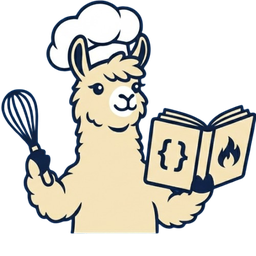

<div align="center">



# Llama Recipe Manager

**A native, fast, batteries-included desktop launcher for `llama-server`.**

Save your `llama.cpp` invocations as named _recipes_, switch between them
in one click, and stop juggling the exact set of flags you settled on for
each model.

[](https://github.com/coder3101/llama-recipe-manager/actions/workflows/ci.yml)
[](./LICENSE)
[](https://tauri.app)
[](https://svelte.dev)
[](https://www.rust-lang.org)

</div>

---

## Highlights

- **Recipe-first workflow.** Each saved recipe is a named bundle of
  `llama-server` flags — switch models / contexts / GPU layouts in one click.
- **Local-first.** No account, no telemetry, no network dependency. Recipes
  live in a SQLite database under your platform's app-data directory.
- **Safety rails.** A flag deny-list rejects recipe arguments that conflict
  with app-managed settings; relative model paths are canonicalised and
  confined to the configured model directory. See [SECURITY.md](./SECURITY.md).
- **Cross-platform & native.** macOS, Linux, Windows — honours system theme
  on all three, with platform-correct app icons.

## Install

Pre-built bundles ship on the
[Releases](https://github.com/coder3101/llama-recipe-manager/releases) page.
To build from source:

```bash
git clone https://github.com/coder3101/llama-recipe-manager.git
cd llama-recipe-manager
bun install
bun run tauri dev      # development
bun run tauri build    # produces an .app / .deb / .AppImage / .msi
```

Prerequisites and full instructions: see
[`docs/Development.md`](./docs/Development.md#build-from-source).

## First-run setup

1. Open Settings (gear icon in the nav rail).
2. Set **llama-server Path** — the chip turns green and shows the version
   when reachable.
3. Pick a **Model directory** — the recipe form's file picker defaults here.
4. (Optional) Set **API key**, **TLS cert/key**, **HF token**, etc.
   They get applied to every recipe you launch.

Then create your first recipe with the `+` button. Recipe arguments are
_just_ the flags — host / port / model / mmproj are injected automatically.

## Documentation

- [Development guide](./docs/Development.md) — build, commands, repo layout,
  app icon regeneration, releases & auto-update, data locations.
- [Security policy](./SECURITY.md) — threat model and how to report issues.
- [Contributing](./CONTRIBUTING.md) — PR workflow, commit style, adding a
  database migration.
- [Code of Conduct](./CODE_OF_CONDUCT.md).
- [Changelog](./CHANGELOG.md).

## License

[MIT](./LICENSE) © 2026 Mohammad Ashar Khan.

Built on top of [llama.cpp](https://github.com/ggml-org/llama.cpp),
[Tauri](https://tauri.app), and [SvelteKit](https://kit.svelte.dev).
